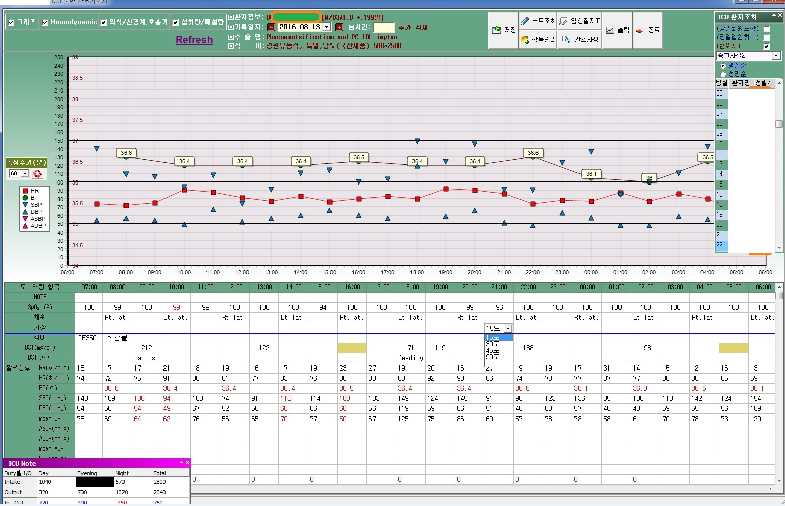

# icu-flowsheet
flowsheet including such patient's status as v/s, gcs, bs, intake/output, diet, lab for intensive-care-unit (D5 -> XE7)

## 오버뷰

## 배경
OO대학병원 중환자실 간호기록지(A3) 전산화(paperless), central-patient monitoring 정보 OCS/EMR 연동

## 기술스택
delphi(D5 -> XE7), oracle, pro*c
